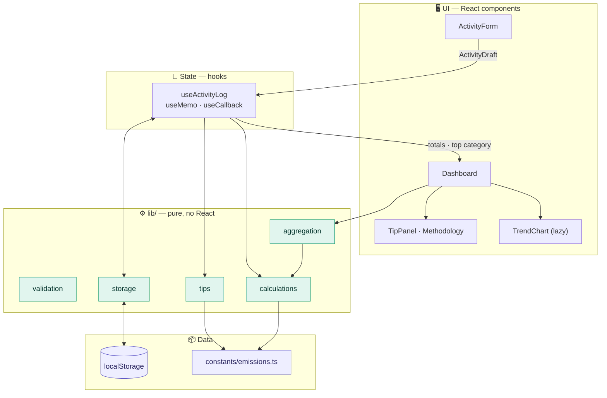
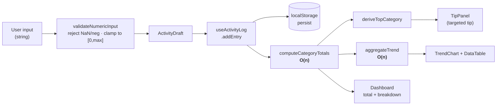

<div align="center">

# 🌍 Carbon Footprint Tracker

**Log daily activities, convert them to CO₂e with published emission factors, and get an actionable tip that targets your single biggest source of emissions.**


-FF6384)


</div>

---

## Table of Contents

- [Feature Overview](#feature-overview)
- [Project Structure](#project-structure)
- [Architecture](#architecture)
- [Data Flow](#data-flow)
- [Tech Stack](#tech-stack)
- [Getting Started](#getting-started)
- [Criteria → Implementation](#criteria--implementation)
- [Technical Deep Dive](#technical-deep-dive)
  - [Calculation Pipeline](#1-calculation-pipeline-pure--total)
  - [Type System & Strictness](#2-type-system--strictness)
  - [Security Model](#3-security-model)
  - [Efficiency & Complexity](#4-efficiency--complexity-analysis)
  - [Accessibility Implementation](#5-accessibility-implementation)
  - [Testing Strategy](#6-testing-strategy)
- [Emission Factors & Sources](#emission-factors--sources)
- [Deployment](#deployment)

---

## Feature Overview

| Feature | Detail |
| --- | --- |
| **Four categories** | Transportation (car/bus/flight km), Energy (electricity kWh), Food (meat/dairy/plant meals), Waste (kg). |
| **CO₂e conversion** | Each unit × a published emission factor → kg CO₂e. |
| **Running total + breakdown** | Grand total plus a per-category table with percentage share. |
| **Trend chart** | Stacked bars with **Daily / Weekly / Monthly** toggles. |
| **Actionable tip** | Keyed off your *actual* highest-emission category — not a static string. |
| **Methodology panel** | In-app "How we calculate this" citing every factor source. |
| **Persistence** | Activity log survives reloads via schema-validated `localStorage`. |

---

## Project Structure

> Every domain number lives under `src/constants/`. The `src/lib/` layer is pure and React-free. Components are single-responsibility.

```text
carbon-footprint-tracker/
├─ index.html                   # Vite HTML entry
├─ package.json                 # Exact-pinned deps + scripts (dev/build/lint/test/coverage)
├─ tsconfig.json                # strict: true, noEmit, noUnused* flags
├─ vite.config.ts               # Vite + React plugin + Vitest (jsdom, v8 coverage)
├─ .eslintrc.cjs                # no-magic-numbers · no-explicit-any · jsx-a11y · no-React-in-lib
│
└─ src/
   ├─ main.tsx                  # React root (StrictMode)
   ├─ App.tsx                   # Composition root: header → form → dashboard → methodology
   ├─ index.css                 # Design tokens, :focus-visible, .sr-only, responsive layout
   │
   ├─ constants/                # ─── SINGLE SOURCE OF TRUTH for all domain numbers ───
   │  ├─ emissions.ts           #   EMISSION_FACTORS · CATEGORIES · MAX_* bounds · TIPS · SOURCES
   │  ├─ ui.ts                  #   Presentation constants (decimals, chart height, input step)
   │  └─ time.ts                #   Date-math constants (key lengths, week-start offsets)
   │
   ├─ types/
   │  └─ index.ts               # Category · ActivityEntry · ActivityDraft · CategoryTotals · TrendPoint
   │
   ├─ lib/                      # ─── PURE, React-free, fully unit-tested logic ───
   │  ├─ calculations.ts        #   units → kg CO₂e · O(n) total aggregation
   │  ├─ validation.ts          #   validate + clamp a single numeric input
   │  ├─ aggregation.ts         #   O(n) daily/weekly/monthly bucketing
   │  ├─ tips.ts                #   deriveTopCategory + getTip
   │  ├─ storage.ts             #   safe localStorage load/save + isActivityEntry schema guard
   │  └─ *.test.ts              #   Vitest units (calculations · validation · aggregation · tips · storage)
   │
   ├─ hooks/
   │  ├─ useActivityLog.ts      # State + persistence + memoized selectors (totals/top category)
   │  └─ useActivityLog.test.ts
   │
   ├─ components/               # ─── Isolated, single-responsibility UI ───
   │  ├─ ActivityForm.tsx       #   <form>/<fieldset>/<label>; validates & clamps on submit
   │  ├─ Dashboard.tsx          #   Total · tip · breakdown · trend · recent-entries list
   │  ├─ CategoryBreakdown.tsx  #   Per-category kg + % table
   │  ├─ TrendSection.tsx       #   Granularity toggle + <Suspense> + lazy chart + data table
   │  ├─ TrendChart.tsx         #   Recharts stacked bars (default export → React.lazy target)
   │  ├─ DataTable.tsx          #   Screen-reader-equivalent of the chart (same data)
   │  ├─ TipPanel.tsx           #   Highest-emission-category tip
   │  ├─ MethodologyPanel.tsx   #   "How we calculate this" + cited sources
   │  ├─ VisuallyHidden.tsx     #   .sr-only helper
   │  └─ *.test.tsx             #   Component tests (ActivityForm · Dashboard · TipPanel · …)
   │
   └─ test/
      └─ setup.ts               # jest-dom matchers · auto cleanup · ResizeObserver polyfill
```

---

## Architecture

A strict four-layer design. Dependencies point **downward only** — UI depends on state, state depends on pure logic, pure logic depends on constants. The `lib/` layer has **zero React imports** (enforced by ESLint), so all business logic is testable in isolation.



---

## Data Flow

The full pipeline from a keystroke to a rendered chart. Input is sanitized **before** it ever reaches state; all derived views are memoized projections of a single `entries` array.



---

## Tech Stack

All dependencies are **pinned to exact versions** (no `^`/`~`) in [`package.json`](package.json) for reproducible builds.

| Concern | Library | Version |
| --- | --- | --- |
| UI | `react` / `react-dom` | `18.3.1` |
| Language | `typescript` | `5.4.5` |
| Build/dev | `vite` + `@vitejs/plugin-react` | `5.2.11` / `4.2.1` |
| Charts | `recharts` | `2.12.7` |
| Tests | `vitest` + `@testing-library/react` | `1.6.0` / `15.0.7` |
| Coverage | `@vitest/coverage-v8` | `1.6.0` |
| Lint | `eslint` + `eslint-plugin-jsx-a11y` | `8.57.0` / `6.8.0` |

---

## Getting Started

```bash
npm install
npm run dev          # → http://localhost:5173
```

| Command | What it does |
| --- | --- |
| `npm run dev` | Run the app in development. |
| `npm run build` | Type-check (`tsc --noEmit`) **then** build for production. |
| `npm run preview` | Serve the production build locally. |
| `npm run lint` | ESLint with **`--max-warnings 0`** (any warning fails). |
| `npm run typecheck` | Strict type-check, no emit. |
| `npm test` | Run the full Vitest suite once. |
| `npm run coverage` | Tests + a V8 coverage report (terminal table + `coverage/index.html`). |

---

## Criteria → Implementation

Every claim is independently verifiable at the cited path.

### 1. Code Quality
| Requirement | Implementation |
| --- | --- |
| Modular, isolated components | One responsibility per file in [`src/components/`](src/components). |
| Factors + metadata in one typed file | [`src/constants/emissions.ts`](src/constants/emissions.ts) — `EMISSION_FACTORS`, `CATEGORIES`, bounds, `TIPS`, `SOURCES`. |
| **Zero magic numbers elsewhere** | `no-magic-numbers` is **on for all of `src/`**, disabled **only** under `src/constants/**` and tests — [`.eslintrc.cjs`](.eslintrc.cjs). |
| Strict TS, no `any` | [`tsconfig.json`](tsconfig.json) `strict: true` + `@typescript-eslint/no-explicit-any: error`. |
| Pure calc decoupled from React | [`src/lib/`](src/lib) is React-free; a `no-restricted-imports` rule **forbids importing React** there. |
| Zero-warning lint | `npm run lint` runs `--max-warnings 0`. |

### 2. Security
| Requirement | Implementation |
| --- | --- |
| Validate & clamp every input | [`src/lib/validation.ts`](src/lib/validation.ts); bounds + rationale in [`emissions.ts`](src/constants/emissions.ts). |
| No `dangerouslySetInnerHTML` / `eval` | Lint bans them: a `no-restricted-syntax` selector + `no-eval` / `no-implied-eval`. |
| Safe `JSON.parse` + schema check | [`src/lib/storage.ts`](src/lib/storage.ts): try/catch with empty fallback, then `isActivityEntry` guards every record. |
| User text rendered, never injected | The note is a React child (`{entry.label}`) in [`Dashboard.tsx`](src/components/Dashboard.tsx) — auto-escaped. |

### 3. Efficiency
| Requirement | Implementation |
| --- | --- |
| Memoize totals + chart data | `useMemo` in [`useActivityLog.ts`](src/hooks/useActivityLog.ts) and [`TrendSection.tsx`](src/components/TrendSection.tsx). |
| Stabilize callbacks | `useCallback` for `addEntry`/`removeEntry` and form handlers. |
| O(n) aggregation, no nested loops | [`aggregation.ts`](src/lib/aggregation.ts) + `computeCategoryTotals` — single `Map`/`reduce` pass. |
| Code-split the chart | [`TrendSection.tsx`](src/components/TrendSection.tsx): `React.lazy(() => import('./TrendChart'))` in `<Suspense>`. |
| Flag deps > ~50 KB gz | **Recharts** is the only one — fully code-split (see [bundle analysis](#4-efficiency--complexity-analysis)). |

### 4. Testing
46 tests, **98.8% statements**. Covers every calc function (zero / negative / missing / very-large / NaN), validation, aggregation, the tip engine, storage, the hook, and components — see [Testing Strategy](#6-testing-strategy).

### 5. Accessibility (WCAG 2.1 AA)
| Requirement | Implementation |
| --- | --- |
| Semantic HTML only | `<form>`, `<fieldset>`/`<legend>`, `<button>`, `<table>` — [`ActivityForm.tsx`](src/components/ActivityForm.tsx). |
| `<label htmlFor>` on every input | Yes — each label is also the input's accessible name (asserted in tests). |
| Visible focus + logical tab order | `:focus-visible { outline: 3px solid … }` in [`index.css`](src/index.css); DOM = tab order. |
| Chart has a table equivalent + `aria-label` | [`DataTable.tsx`](src/components/DataTable.tsx) mirrors the data; [`TrendChart.tsx`](src/components/TrendChart.tsx) is `role="img"` with a sentence summary. |
| ARIA labels on icon-only buttons | Remove-entry "×" has `aria-label="Remove entry from …"`. |
| Contrast ≥ 4.5:1 | All text/UI pairs meet AA; lowest ratio is **6.16:1** (verified with the WCAG formula). |

### 6. Problem Statement Alignment
Every feature serves *track and reduce*: log → total → breakdown → trend → targeted tip → methodology. No auth, no social, no scope creep. The tip is selected by `deriveTopCategory` in [`tips.ts`](src/lib/tips.ts) from the **actual** highest-emission category.

---

## Technical Deep Dive

### 1. Calculation Pipeline (pure → total)

All conversions are pure functions (`input × factor`), composed bottom-up. A single `safe()` guard normalizes every value, which is why one helper covers all the required edge cases:

| Input to `safe(n)` | Result | Rationale |
| --- | --- | --- |
| valid `n ≥ 0` | `n` | normal path |
| `0` | `0` | no activity logged |
| negative | `0` | a negative activity amount is meaningless → rejected |
| `NaN` / `±Infinity` | `0` | non-finite is never trusted |
| `undefined` / missing field | `0` | partial objects don't crash the math |

```
calc{Transportation,Energy,Food,Waste}  →  calcEntryTotals  →  computeCategoryTotals (reduce)  →  grandTotal
```

Because the functions are decoupled from React and side-effect-free, the entire money-path is tested at **100%** in [`calculations.test.ts`](src/lib/calculations.test.ts).

### 2. Type System & Strictness

- `tsconfig.json` enables `strict: true` plus `noUnusedLocals`, `noUnusedParameters`, and `noFallthroughCasesInSwitch`.
- `@typescript-eslint/no-explicit-any: error` — `any` is impossible, even accidentally.
- `Category` is a string-literal union; `CategoryTotals = Record<Category, number>` guarantees totals can never miss a category.
- `EMISSION_FACTORS` is declared `as const` (readonly literal types); `CATEGORIES` metadata references those values, so the form, calculator, chart series, and methodology table all derive from **one** declarative list.
- Type-only imports (`import type`) keep the runtime graph clean under `isolatedModules`.

### 3. Security Model

This is a client-only app, so the threat surface is **untrusted input** and **untrusted persisted state**.

```ts
// storage.ts — never trust what comes back from localStorage
try {
  const parsed: unknown = JSON.parse(raw);
  if (!Array.isArray(parsed)) return [];
  return parsed.filter(isActivityEntry);   // structural guard on every record
} catch {
  return [];                                // corrupt JSON → safe empty log
}
```

| Vector | Mitigation |
| --- | --- |
| Malicious / absurd numbers | `validateNumericInput` rejects `NaN`/negative and clamps to documented per-field `MAX_*` bounds. |
| Corrupt / hand-edited storage | `JSON.parse` in try/catch + `isActivityEntry` shape check before any value is used. |
| XSS via the free-text note | Rendered as a React child (auto-escaped); `dangerouslySetInnerHTML` is lint-banned. |
| Arbitrary code execution | `no-eval` / `no-implied-eval` lint rules. |

### 4. Efficiency & Complexity Analysis

**Algorithmic complexity** — aggregation is linear; there are no nested loops over the log.

| Operation | Location | Complexity |
| --- | --- | --- |
| Per-entry CO₂e | `calcEntryTotals` | `O(1)` |
| Totals across the log | `computeCategoryTotals` | `O(n)` (single `reduce`) |
| Trend bucketing | `aggregateTrend` | `O(n)` pass + `O(k log k)` sort over `k` distinct periods |
| Highest category | `deriveTopCategory` | `O(1)` (4 categories) |

**Memoization map** — every derived view recomputes only when its inputs change:

| Memoized value | Where | Dependencies |
| --- | --- | --- |
| `totals` | `useActivityLog` | `[entries]` |
| `total` | `useActivityLog` | `[totals]` |
| `topCategory` | `useActivityLog` | `[totals]` |
| chart `data` | `TrendSection` | `[entries, granularity]` |
| chart `summary` | `TrendSection` | `[data, granularity]` |
| `addEntry` / `removeEntry` | `useActivityLog` (`useCallback`) | `[]` (stable) |

**Bundle analysis** (`npm run build`) — Recharts is the only dependency over ~50 KB gz and is **fully code-split**, so it never ships in the initial download:

| Chunk | Raw | Gzip | Loaded |
| --- | --- | --- | --- |
| `index-*.js` (app + React) | 157.94 kB | **51.28 kB** | initial |
| `index-*.css` | 3.37 kB | 1.26 kB | initial |
| `TrendChart-*.js` (Recharts) | 358.57 kB | 100.71 kB | **lazily, on chart render** |

### 5. Accessibility Implementation

- **Semantic structure:** a real `<form>`, one `<fieldset>` + `<legend>` per category, and a `<button type="submit">` — no div-soup.
- **Labels:** every input is associated via `<label htmlFor>`; the label text *is* the accessible name (a test asserts `getByRole('spinbutton', { name: /car \(km\)/i })`).
- **Errors:** invalid fields set `aria-invalid` and `aria-describedby`, with the message in `role="alert"`.
- **Charts → tables:** the chart is `role="img"` with a sentence `aria-label` (e.g. *"Daily CO2e emissions from … currently rising"*), and an equivalent `<DataTable>` renders the same numbers for screen readers.
- **Icon buttons:** the "×" remove button carries an `aria-label`.
- **Focus & contrast:** a visible `:focus-visible` outline on all interactive elements; all text/UI color pairs meet AA (lowest **6.16:1**).

### 6. Testing Strategy

A classic pyramid: exhaustive pure-logic units at the base, a hook integration test, and focused component tests at the top.

| Area | Statements | Branches | Notes |
| --- | --- | --- | --- |
| `lib/` | ~99–100% | ~94–100% | calculations, validation, aggregation, tips, storage |
| `hooks/` | 94% | 92% | add/remove/derive + persistence round-trip |
| `components/` | 99% | 81% | form a11y, dashboard render, tip, chart, methodology |
| **Overall** | **98.81%** | **88.74%** | 46 tests across 11 files |

- **Required edge cases** for each calc function: zero, the negative-rejection path, missing/undefined fields, a very large value, and `NaN` — in [`calculations.test.ts`](src/lib/calculations.test.ts).
- **Component tests:** [`ActivityForm.test.tsx`](src/components/ActivityForm.test.tsx) asserts inputs are reachable by accessible name and that negatives are rejected; [`TipPanel.test.tsx`](src/components/TipPanel.test.tsx) asserts the highest-category tip renders.
- **jsdom note:** [`test/setup.ts`](src/test/setup.ts) polyfills `ResizeObserver` (absent in jsdom) so Recharts' `ResponsiveContainer` renders under test.

---

## Emission Factors & Sources

Defined once in [`src/constants/emissions.ts`](src/constants/emissions.ts) and surfaced in-app via the **"How we calculate this"** panel.

| Activity | Factor (kg CO₂e) | Per | Source |
| --- | --- | --- | --- |
| Car (average) | 0.170 | km | UK DEFRA/DESNZ 2023 |
| Bus (local) | 0.103 | km | UK DEFRA/DESNZ 2023 |
| Flight (domestic, incl. radiative forcing) | 0.246 | km | UK DEFRA/DESNZ 2023 |
| Electricity (UK grid) | 0.207 | kWh | UK DEFRA/DESNZ 2023 |
| Meat-based meal | 3.3 | meal | Poore & Nemecek 2018 / Our World in Data |
| Dairy / vegetarian meal | 1.9 | meal | Poore & Nemecek 2018 / OWID |
| Plant-based meal | 0.9 | meal | Poore & Nemecek 2018 / OWID |
| Waste (to landfill) | 0.45 | kg | US EPA WARM / DEFRA waste |

**Validation bounds** (the "absurd value" caps, with rationale in `emissions.ts`). Inputs are clamped to `[0, max]`; `NaN`, negatives, and non-finite values are rejected:

- **Distance:** 20 000 km/day per mode (beyond the longest non-stop commercial flight).
- **Electricity:** 1 000 kWh/day (~20× a high-use household).
- **Meals:** 50/day per type · **Waste:** 1 000 kg/day.

---

## Deployment

Containerized and deployed to **Google Cloud Run** (HTTPS, scales to zero). The image is a multi-stage build — Vite build → nginx — serving on port `8080` with an SPA fallback, year-long immutable caching for hashed assets, and security headers (CSP, `X-Frame-Options`, `X-Content-Type-Options`, `Referrer-Policy`). See [`Dockerfile`](Dockerfile) and [`nginx.conf`](nginx.conf).

```bash
# From Cloud Shell (gcloud already authenticated):
git clone https://github.com/Jagadeesh9hub/Promptwar.git && cd Promptwar
gcloud run deploy carbon-footprint-tracker \
  --source . --region us-central1 --allow-unauthenticated --port 8080
```

Full instructions — project setup, redeploy, and cost notes — are in [`DEPLOY.md`](DEPLOY.md).

